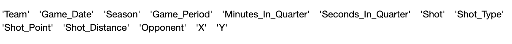
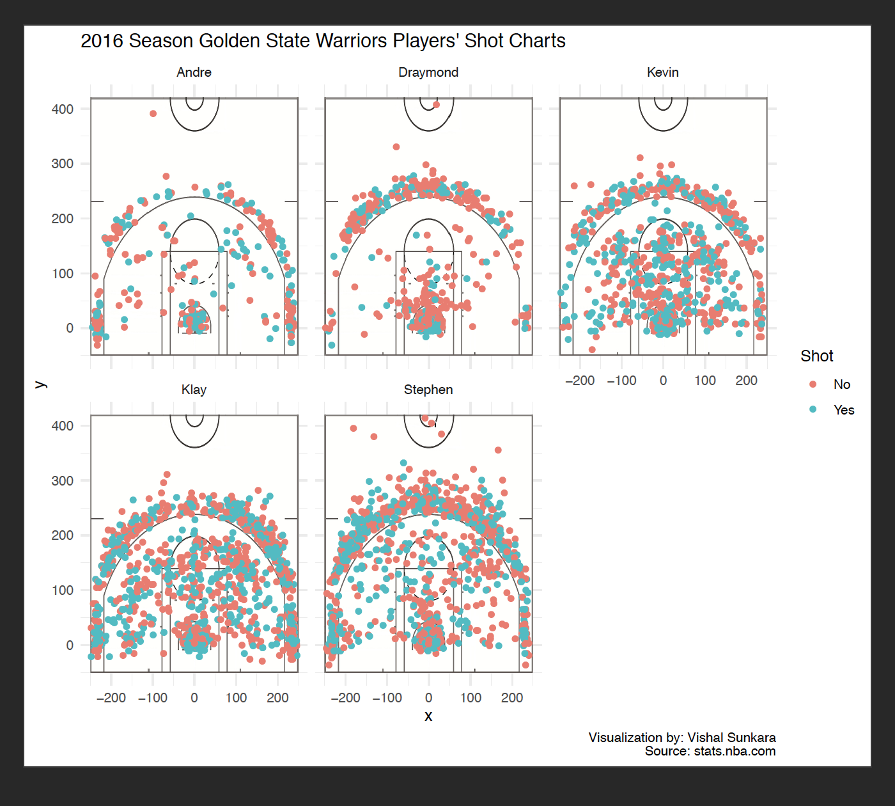
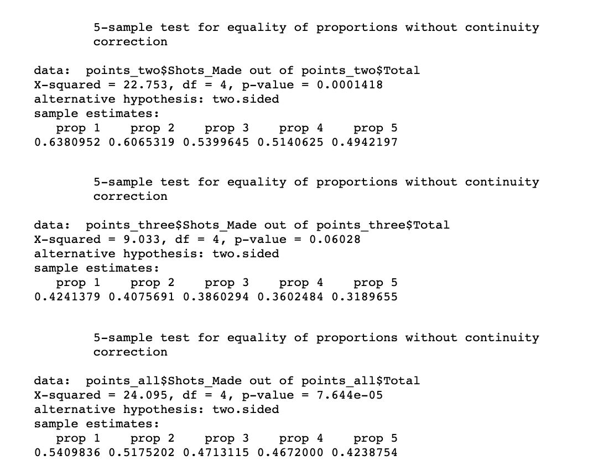
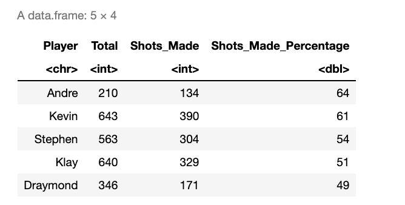
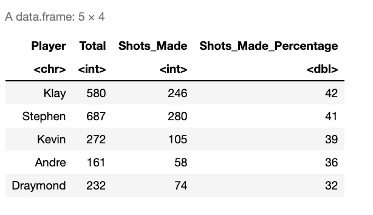
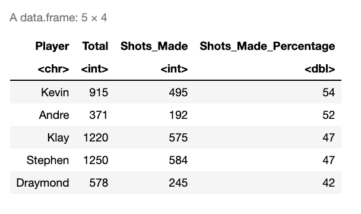

Author: Vishal Sunkara
==========================================================================================

Visualization & Analysis of Golden State Warriors' Players from the 2016 Season 
==========================================================================================

Background
----------

2016-2017 was an exciting season in the NBA. The addition of Kevin Durant that season in the Golden State Warriors that already had other superstar players like Stephen Curry, Klay Thompson, and Draymond Green made this season a very interesting subject to study and visualize. The study I pursued was to determine what type of shooting was critical for the success of the players and which of those shootings made one player more successful than the other in the team. For this, I will be visualizing a shot chart based on data from stats.nba.com and analyze it through the R programming Language. The players I am going to choose for this project are Stephen Curry, Kevin Durant, Klay Thompson, Draymond Green, and Andre Iguodala.   

Here is some background information on the players at the time of the 2016 NBA Season that I am researching. A player's shooting position can be affected by their role on the court and their physical characteristics. Thus, it will be important to take these details into consideration as it will make an impact on our analysis of the visualized data and the insights that are implied from it.

NBA GSW 2016 Season Players Information 

Stephen Curry
Age: 30
Height: 6'3
Weight: 190 lb
Position: Point Guard

Kevin Durant 
Age: 30
Height: 6'9
Weight: 240 lb
Position: Small Forward/Power Forward

Klay Thompson
Age: 29
Height: 6'7
Weight: 215 lb
Position: Shooting Guard

Draymond Green
Age: 29
Height: 6'7
Weight: 230 lb
Position: Power Forward

Andre Iguodala
Age: 35
Height: 6'6
Weight: 215 lb
Position: Shooting Guard/Small Forward


Cleaning the Data
----
I downloaded data from stats.nba.com for each player and made appropriate changes to column names
and filled empty cells with NA. I had 5 csv files in total and this data contained information of the shots that Stephen, Kevin, Klay, Draymond, and Andre took in the 2016 season. I stored these csv files in a folder called data_extracted in the project directory Final_Project_STAT266A.  

``` r
# Defining types for each column in the csv. 
columns_in_csv = c("character", "character", "integer", "integer", "integer", "integer", "factor","character","factor","integer","character", "integer", "integer")
# Reading from csv files for each player into dataframes. 
steph_curry <- read.csv("data_extracted/stephen-curry.csv", stringsAsFactors = F, colClasses = columns_in_csv)
kevin_durant <- read.csv("data_extracted/kevin-durant.csv", stringsAsFactors = F, colClasses = columns_in_csv)
klay_thompson <- read.csv("data_extracted/klay-thompson.csv", stringsAsFactors = F, colClasses = columns_in_csv)
draymond_green <- read.csv("data_extracted/draymond-green.csv", stringsAsFactors = F, colClasses = columns_in_csv)
andre_iguodala <- read.csv("data_extracted/andre-iguodala.csv", stringsAsFactors = F, colClasses = columns_in_csv)

# This gives the name of the variables in the spreadsheets of the csv files.
names(steph_curry)
names(kevin_durant)
names(klay_thompson)
names(draymond_green)
names(andre_iguodala)
```



``` r
# Creating a variable Player in each dataframe extracted from respective excel sheets to identify and describe the player that the data represents.
steph_curry <- mutate(steph_curry, Player = "Stephen")
kevin_durant <- mutate(kevin_durant,Player  = "Kevin")
klay_thompson  <- mutate(klay_thompson, Player = "Klay")
draymond_green <- mutate(draymond_green, Player = "Draymond")
andre_iguodala <- mutate(andre_iguodala, Player = "Andre")
```

``` r
# binding all the dataframes that I read from csv files into 1 dataframe.
new_df <- rbind(steph_curry, kevin_durant, klay_thompson, draymond_green, andre_iguodala)
# Writing this dataframe with a collection of data of each player into csv file.
write.csv(new_df, file = "data_extracted/GSW_Players_Shot_Data.csv")
```


Visualization
---------------

Before I visualize, I'll take some key ideas into examination. For example, general places that players shoot from and the distribution of player shots during the games ultimately give insights to how game strategies can be improved. To gain these insights, it is essential to create a visualization that can illustrate the comparisons of positions that each player shoots from. Thus, to aid this comparison, I will determine whether a shot has been made or missed through one of the columns "Shot" from our new_df dataframe. I will use visual cues to show the difference. So, in the visualization, a red color indicates that shot has been missed and a blue color indicates that a shot has been made. Because we are visualizing a shot chart, I will require the image of a half court to show the positions that the shots were taken from. So, I downloaded an image of a sketch of a basketball half court and then scaled the (X,Y) coordinates of the shots described in the new_df dataframe to ensure proper fit of the plottings in the image. Also, I will use facet_wrap() to create multi-panel plots and this will contribute to a shot chart corresponding to each player. Finally, this will improve readability and easy discerning of analysis of player shots for comparison through the visualization. I also add a caption to indicate the source of my data and to author my visualization in the following lines of code.

``` r
ggplot(data = new_df) + 
  annotation_custom(background_img, -250, 250, -50, 420) +
  geom_point(aes(x = x, y = y, color = Shot)) +
  ylim(-50,420) +
  ggtitle("2016 Season Golden State Warriors Players' Shot Charts") +
  labs(caption = "Visualization by: Vishal Sunkara\nSource: stats.nba.com") +
  theme_minimal() + facet_wrap(Player ~.)
```


Looking at the visualization, there are multiple plots for each player. One detail that sticks out and is easy to notice is how for every player a large concentration of their shots are close to the basket. This is implied because a lay up (a two-point shot attempt made by leaping from below, laying the ball up near the basket) is a very common way of shooting in this game. Upon observing Andre and Draymond, we can see how most of their shots are taken from the three point line or close to the basket. On the other hand, Stephen, Kevin, and Klay have their shots concentrated all over the court from the three point line. The visualized data makes sense because of the positions that these players represent and play on court. Take Andre and Draymond for instance. Andre is a small forward and shooting guard and Draymond is a power forward. The shot charts reflect this because generally shooting guards shoot from the three point line and small forwards move around the court which justifies the shots Andre took in the 2016 NBA season. Similarly, power forwards take most of the shots close to the basket and this is justified by Draymond's shot chart. Now, looking at the shot charts of Stephen, Kevin, and Klay, it seems as if there are more data points displayed compared to the other two which leads to the question of discrepancy in the data. But, surprisingly that is not the case and upon further inspection there is a lot implied in these visualizations to take into account. The shot charts for Stephen, Kevin, and Klay showcase that these players are simply better shooters implying their attempt to shoot more and their ability to maintain confidence with their shots. Clearly, it becomes evident that these players are more versatile in their play and go beyond what their roles on the court entail. 


Analysis
---------------

Now let's examine for each player the number of shots made versus the number of shots attempted to analyze the effectiveness of players in their shooting abilities. We can build a comparison between the players by testing the proportions using prop.test on new dataframes that are subsets of the original and consist of information of the players' shots with repect to 2-point field goals, 3-point field goals, shots attempted, and shots made.

``` r
library(dplyr)


temp_df <- read.csv("/data_extracted/GSW_Players_Shot_Data.csv", stringsAsFactors = F)


shot_two <- select(filter(temp_df, Shot_Point == "2PT Field Goal"), Player, Shot)
points_two = shot_two %>%
  group_by(Player) %>%
  summarise(Total = n(), Shots_Made = sum(Shot == "Yes")) 
points_two <- arrange(mutate(points_two, Shots_Made_Percentage = round((Shots_Made/Total)*100)), desc(Shots_Made_Percentage))
points_two <- as.data.frame(points_two)
```

``` r
shot_three <- select(filter(temp_df, Shot_Point == "3PT Field Goal"), Player, Shot)
points_three = shot_three %>%
  group_by(Player) %>%
  summarise(Total = n(), Shots_Made = sum(Shot == "Yes")) 
points_three <- arrange(mutate(points_three, Shots_Made_Percentage = round((Shots_Made/Total)*100)), desc(Shots_Made_Percentage))
points_three <- as.data.frame(points_three)
```

``` r
all <- select(temp_df, Player, Shot)
all_points = all %>%
  group_by(Player) %>%
  summarise(Total = n(), Shots_Made = sum(Shot == "Yes")) 
all_points <- arrange(mutate(all_points, Shots_Made_Percentage = round((Shots_Made/Total)*100)), desc(Shots_Made_Percentage))
all_points <- as.data.frame(all_points)
```

In the proportions test, the null tested is that the proportions for each player are the same in terms of two point shots, three point shots, and overall points. Thus, for each group of shots it was indicated that the raw proportions regarding the number of shots made versus the number of shots attempted were not the same for each player. 

```r
a <- prop.test(points_two$Shots_Made, points_two$Total, p = NULL, alternative = "two.sided", correct = TRUE)
b <- prop.test(points_three$Shots_Made, points_three$Total, p = NULL, alternative = "two.sided", correct = TRUE)
c <- prop.test(all_points$Shots_Made, all_points$Total, p = NULL, alternative = "two.sided", correct = TRUE)

a
b
c
```



Now, lets print the data frames that can showcase a matrix of rows and columns allowing for easy discerning of the number of shots made versus the number of shots attempted for each player between the different point groups.

``` r
points_two
points_three
all_points
```

Two Point Shots



Three Point Shots



Both Two Point and Three Point Shots



In these dataframes, it can be noticed that percentage-wise Andre is the highest for the 2 point field goal group. But, this might be misleading because it is important to understand that Andre attempts less number of shots compared to other players and probably has a high percentage because he is careful with his shots. On the other hand, Klay has the highest percentage-wise for the 3 point field goal group. For every player, the percentages are smaller for 3 pointers because of how they are usually more difficult to make. Surprisingly, Kevin had the highest percentage-wise for overall points with respect to other players when inluding both 2 point and 3 point field goals for shots made versus shots attempted. This came to me as a surprise because Stephen is regarded as the best player in the team. Although he does score more, he makes the most shot attempts in some categories and this is why his percentage of shots made is less. 


Conclusion
----------

In summary, through visualization, I have to come to arrive at the conclusion that players can be more successful if they play beyond what their role entails on the court and this ultimately correlates to more points for the team. And through analysis, it was evident that a higher percentage of shots made versus shots attempted did not account for the measure of a player's performance. Although, it was implied from the analysis that the players that made the most points for the team were the ones that take more attempts. 
